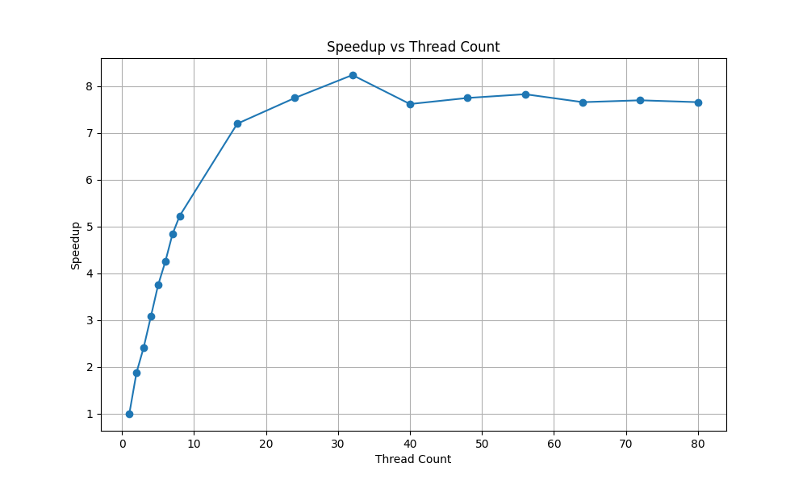

# Project 2: Multithreaded Hashing and Amdahl's Law

## Overview
In this project, we explore how to improve the performance of a hash computation program by using multiple CPU cores, even though the structure of the data prevents vectorization. We also apply Amdahl’s Law to understand the theoretical limits of parallel speedup and analyze real-world performance data using timing instrumentation.
## Speedup Table
|Thread Count|Wall Clock Time|User Time|System Time|Speedup|
|:--:|--:|--:|--:|:--:|
|1|14.33|13.69| 0.50|1.00|
|2| 7.63|14.15| 0.59| 1.88|
|3| 5.93|16.02| 0.68| 2.42|
|4| 4.66|16.22| 0.78| 3.08|
|5| 3.82|16.02| 0.93| 3.75|
|6| 3.37|16.59| 1.02| 4.25|
|7| 2.96|16.49| 1.07| 4.84|
|8| 2.74|16.69| 1.20| 5.23|
|16| 1.99|18.33| 2.96| 7.20|
|24| 1.85|18.64| 7.66| 7.75|
|32| 1.74|18.39|16.22| 8.24|
|40| 1.88|17.97|21.03| 7.62|
|48| 1.85|17.55|28.94| 7.75|
|56| 1.83|17.71|37.13| 7.83|
|64| 1.87|17.48|44.00| 7.66|
|72| 1.86|17.71|53.49| 7.70|
|80| 1.87|17.70|42.44| 7.66|
## Speedup Graph

## Amdahl’s Law Calculation
### Calculations:

- Serial setup = `0.000093595`
- Output = `0.000000691`
- Total = `0.03791249`

So:

$$
s = \frac{0.000093595 + 0.000000691}{0.03791249} = 0.00249
$$

$$
p = 1 - s = 0.99751
$$

Amdahl’s Law for 16 threads:

$$
\text{speedup} = \frac{1}{(1 - p) + \frac{p}{16}} = \frac{1}{0.00249 + 0.06234} = \frac{1}{0.06483} ≈ 15.42
$$

**Theoretical speedup on 16 threads ≈ 15.42×**
## Questions
### Notice that there is a maximum speed-up factor, but not necessarily using the most threads. Make a guess (i.e., write a short paragraph) as to why you think more threads aren't necessary better. Here's a hint: think about a group of people waiting to go through a turnstile (like at BART or Disney World). Are more people able to go through it just because there are more people? 
Adding more threads doesn’t always help because there are limits. Only one thread can do certain things at a time, like writing to a file or using shared memory

### Do you think it's possible to get "perfect scaling" — meaning that the $(1-p)$ terms is zero?
No. There’s always a small part of the program that can’t be split between threads, like setting things up or writing the results. Because of that, the program will never scale perfectly no matter how many threads we use.

### in reviewing the graph of speed-ups to number of threads, note that we get pretty linear (when you plot the dots, they're pretty close to being a line) speed-up. What's the slope of that line? (Pick two values, like for one and seven threads, and do the rise-over-run thing you learned in Algebra). Does that linear trend continue as we add more threads? What do you think causes the curve to "flatten out" when we use large thread counts?
From 1 thread to 7 threads, the speedup went from 1.00 to 4.84. That’s a slope of about: (4.84 - 1.00) / (7 - 1) = 3.84 / 6 ≈ 0.64
it’s mostly a straight line at first. But after more threads the line flatten becuae  start fighting over memory and some parts of the program can’t run in parallel.

