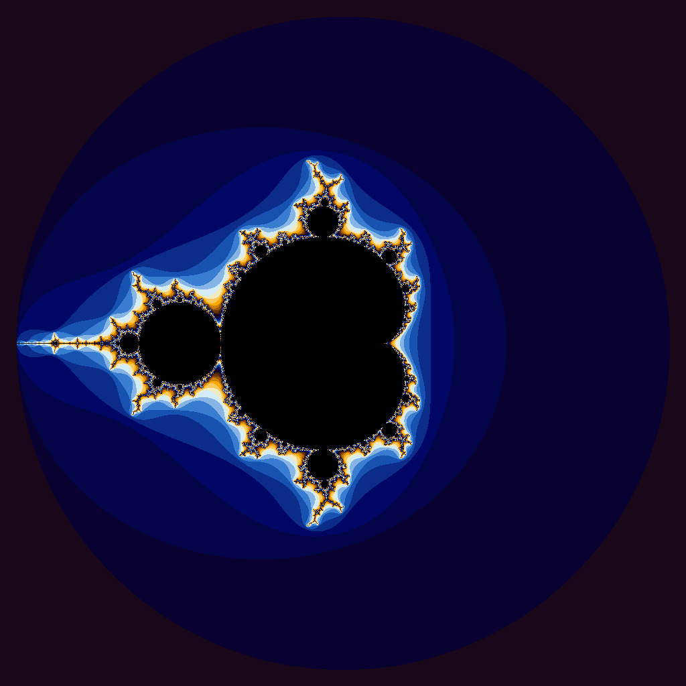

# CS 351 — Project 4: CUDA Programming

## 👨‍💻 Project Objectives

This project explores the use of NVIDIA CUDA to parallelize and accelerate computations on a GPU. We implemented two separate applications:

1. A parallel version of the `std::iota` function.
2. A GPU-accelerated renderer of a Julia set.
## `iota` Function GPU vs. CPU

| Vector Length | GPU Wall Clock (s) | GPU User (s) | GPU Sys (s) | CPU Wall Clock (s) | CPU User (s) | CPU Sys (s) |
|:---------------:|-----------------------:|-------------:|------------:|-----------------------:|-------------:|------------:|
| 10              | 0.28                   | 0.01         | 0.27        | 0.00                   | 0.00         | 0.00        |
| 100             | 0.20                   | 0.01         | 0.19        | 0.00                   | 0.00         | 0.00        |
| 1,000           | 0.20                   | 0.00         | 0.19        | 0.00                   | 0.00         | 0.00        |
| 10,000          | 0.21                   | 0.00         | 0.20        | 0.00                   | 0.00         | 0.00        |
| 100,000         | 0.20                   | 0.01         | 0.19        | 0.00                   | 0.00         | 0.00        |
| 1,000,000       | 0.21                   | 0.01         | 0.19        | 0.00                   | 0.00         | 0.00        |
| 5,000,000       | 0.24                   | 0.01         | 0.22        | 0.02                   | 0.00         | 0.02        |
| 100,000,000     | 0.86                   | 0.16         | 0.70        | 0.59                   | 0.08         | 0.50        |
| 500,000,000     | 3.51                   | 0.82         | 2.68        | 2.96                   | 0.43         | 2.52        |
| 1,000,000,000   | 6.89                   | 1.64         | 5.24        | 5.85                   | 0.89         | 4.95        |
| 5,000,000,000   | 48.15                  | 8.55         | 39.60       | 37.17                  | 6.38         | 30.79       |
### Are the results what you expected? Speculate as to why it looks like CUDA isn't a great solution for this problem.
Not really. I initially expected the GPU version to be faster earlier around a 1,000,000. I know CUDA has overhead for launching kernels and transfering memory 
but I was suprised that even at 5,000,000,000 it was not faster. Since the task was simple the overhead cost more then the parallel benefits unless we go very large scale.

## Julia Set Fractal

